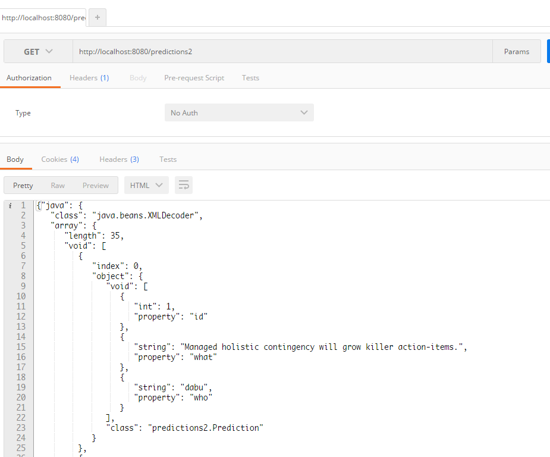

##Servlet写的 Restful webservice

见：[《webservice笔记3——REST风格的java service 框架及使用Servlet实现Restful webservice》](http://www.dabu.info/webservice-restful-framework-servlet.html)

截图：

访问整个list，以xml：
http://localhost:8080/resourcesP/xml

访问整个list，以json：
http://localhost:8080/resourcesP/json

单条记录：
http://localhost:8080/resourcesP/xml/1

http://localhost:8080/resourcesP/json/1

